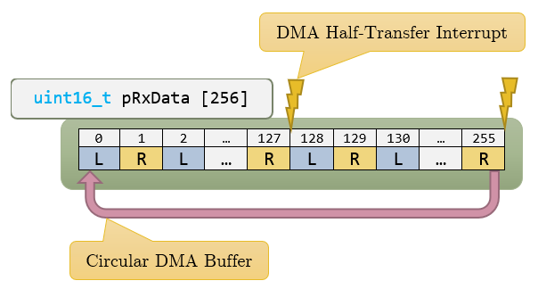
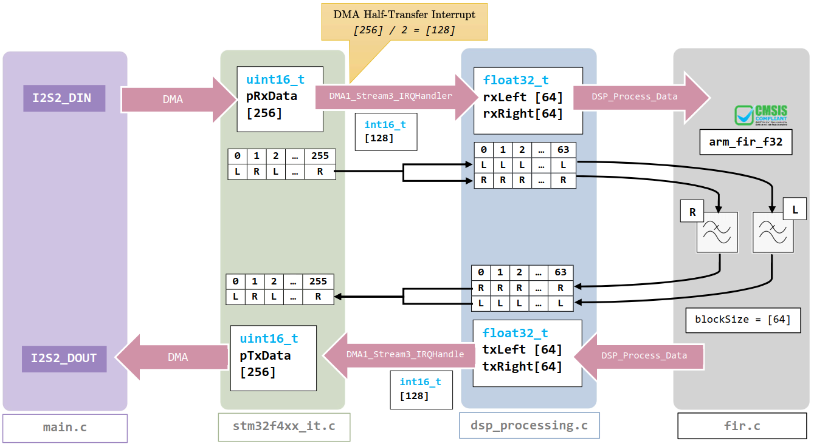

# P5-DSP-Board-mdk
C Firmware for FHNW P5 DSP Board based on STM32F412 / TLV320aic

---

Demo Software for a custom Hardware.

---

### Abstract

In amateur radio (HAM) and hobby music one often wishes a cheap and simple solution for an signal processing box to either apply an effect to the music or use a filter to block unwanted tones.
The ARM Cortex-M4 series is a low cost processor architecture that offers floating point digital signal processing (DSP) capabilities.
The goal of this project is the development of such an effect box with the focus on good performance at low cost. 
The device uses an STM32F412 microcontroller with a TLV320 stereo audio codec and features a USB port for power and programming. The developed board also features two 1" OLED displays, two rotary encoders and two pushbuttons and is capable of running on a rechargeable battery.
As a result the audio signal can be processed using the ARM CMSIS/DSP signal processing library. For demonstration purposes a software, implementing a simple FIR lopass filter, along with a user interface is installed on the board.

**Keywords**

ARM Cortex-M4}, CMSIS/DSP, Audio Effect Box, Digital Signal Processing


---

### DSP Dataflow



The Data is sampled through I2S2 and stored in a buffer via DMA.



The full data processing workflow is visible above.


---

### SSD1306 OLED

[mnemocron/stm32-ssd1306](https://github.com/mnemocron/stm32-ssd1306)

```c
SSD1306_t holed1;

holed1.hi2cx = &hi2c1;

ssd1306_Init(&holed1);
ssd1306_Fill(&holed1, Black);
ssd1306_SetCursor(&holed1, 2, 0);
ssd1306_WriteString(&holed1, "Hello,", Font_11x18, White);
ssd1306_UpdateScreen(&holed1);

```

---

### License

Copyright (c) 2019 Simon Burkhardt, Mischa Studer

No license applies! You may not reuse the provided code in any form wthout permission.


